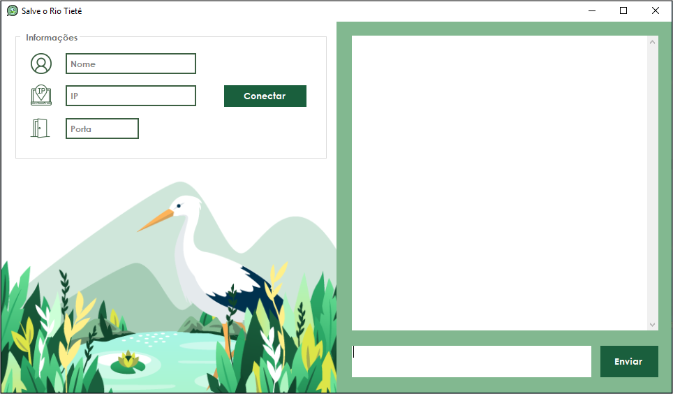

# Chat-TCP-IP
Chat para troca de mensagens entre usuários utilizando o protocolo TCP/IP

Este projeto é um chat para comunicação de diversos usuários através de uma conexão local utilizando o protocolo TCP/IP. Ele foi desenvolvido conjuntamente com minha colega Joyce Querubino e conforme o tema do trabalho da faculdade UNIP do curso de Ciência da Computação, que definia a aplicação para comunicação de servidores públicos responsáveis pelos cuidados do Rio Tiête.   

<h4 align = center> Aplicação do Chat para conexão, envio e recebimento de mensagens. </h4>
<h1>
    
</h1>

<h4 align = center> Aplicação do Servidor para monitoramento e armazenamento de mensagens. </h4>

<h1 align = center>
    
</h1>

## Tecnologias utilizadas

- Linguagem C# ;
- Bibliotecas; 
- Visual Studio 2019;

## Funcionamento

Para que seja possível a troca de informações, são necessárias duas aplicações: o ‘cliente’ cuja finalidade é se conectar ao servidor para enviar e receber mensagens, e um ‘servidor’ responsável por realizar as conexões e armazena-las em uma ‘hash table’, a qual vai distribuir as mensagens para os usuários.

**Quando for testar:** 

- Abra o aplicativo do servidor no diretório: Chat-TCP-IP\ChatServidor\ChatServidor\bin\Debug\ChatServidor
- Insira o enreço de IP: **127.0.0.1**, resposável pela conexão LAN;
- Insira uma porta, por exemplo: **60**;
- Inicie o servidor; 
- Abra duas vezes a aplicação do Chat no diretório: Chat-TCP-IP\ChatApp\bin\Debug\ChatApp. No caso, será uma aplicação aberta para cada usuário e como vamos testar a comunicação entre duas pessoas, abriremos duas interfaces; 
- Insira um nome de usuário;
- E insira os mesmos valores adicionados anteriormente na aplicaçao do servidor para o endereço IP e porta;
- E clique em 'Conectar'.

Obs.: Não insira um nome que já¡ foi utilizado anteriormente e não insira a palavra 'Administrador' como nome. 

## Design

O Design da aplicação foi criado de acordo com o tema, visando a melhor usabilidade do usuário e todas as imagens utilizadas foram de autoria própria, exceto o ícone do servidor. 

## Links úteis

A aplicação esta repleta de comentários que vão te auxiliar a entender melhor seu funcionamento, porém se ainda tiver dúvidas veja os artigos do professor **José Carlos Macoratti** utilizados como base para o desenvolvimento do projeto.

[Explicação da Aplicação Cliente](http://www.macoratti.net/11/08/c_chat1.htm)

[Explicação da Aplicação Servidor](http://www.macoratti.net/11/08/c_chat2.htm)

Espero que está aplicação possa te auxiliar com novas descobertas e aprendizagem.
<h5 align = center>Desenvolvido por Joyce Querubino e Luiz Guilherme Machado Lourenço </h5>
